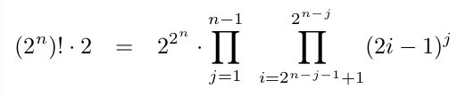

# Mathematical-expressions
From:  
https://docs.github.com/en/get-started/writing-on-github/working-with-advanced-formatting/writing-mathematical-expressions  
This sentence uses `$` delimiters to show math inline:  $\sqrt{3x-1}+(1+x)^2$

Works even when edited on github with Preview ...

This is a formula with factorial, powers of 2 and odd numbers I tweeted on the weekend:  
$(2^n)! \cdot 2 = 2^{2^n} \cdot  \prod_{j=1}^{n-1} \enspace  \prod_{i=2^{n-j-1}+1}^{2^{n-j}}(2i-1)^{j}$

My fault that above formula looked that bad, I used single '$' for inline formula.  
Framing with '$$' the products look much better now:  
$$(2^n)! \cdot 2 = 2^{2^n} \cdot  \prod_{j=1}^{n-1} \enspace  \prod_{i=2^{n-j-1}+1}^{2^{n-j}}(2i-1)^{j}$$

Similar to screenshot from Latex rendered formula:  

